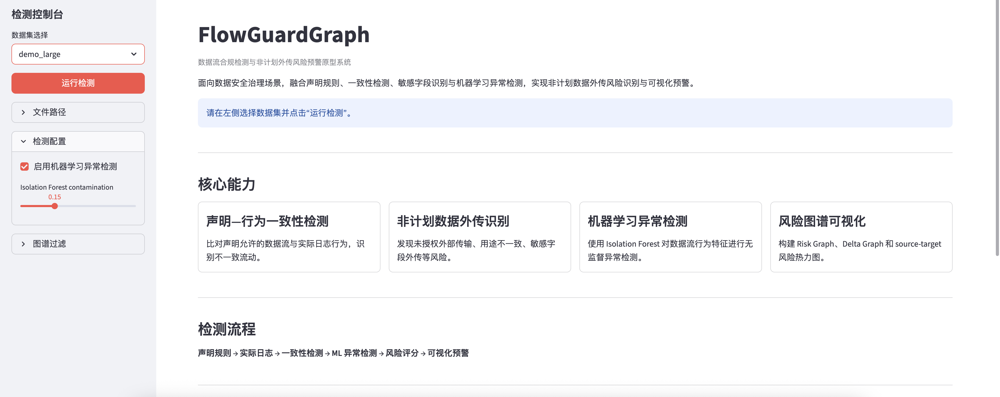
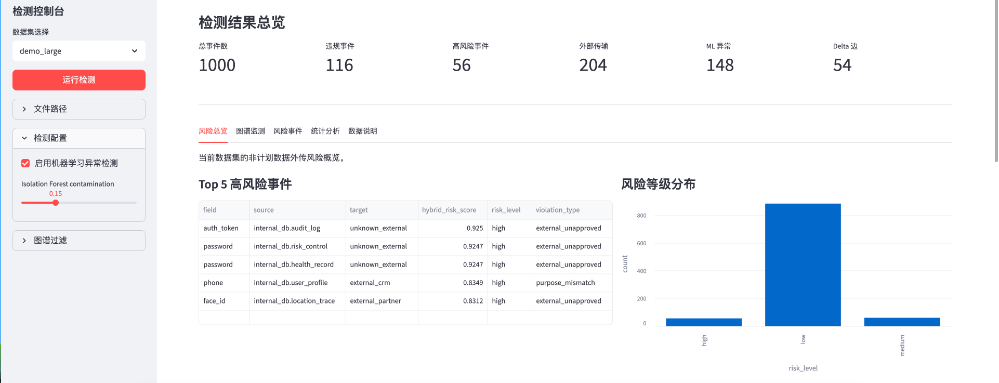
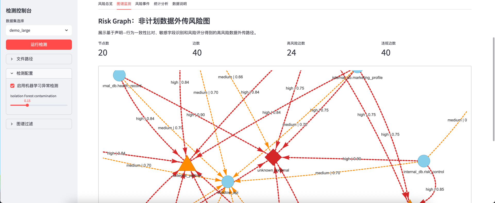
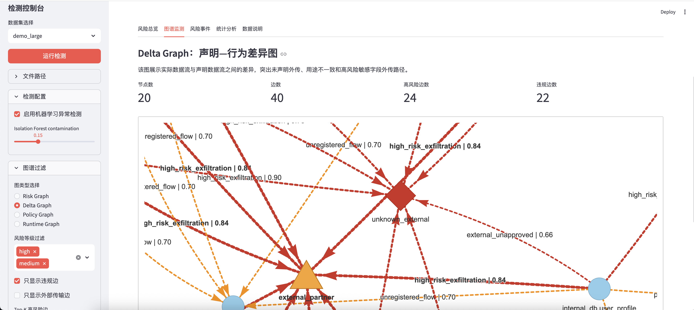
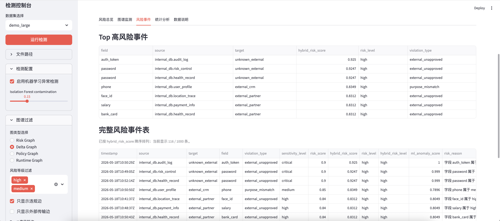
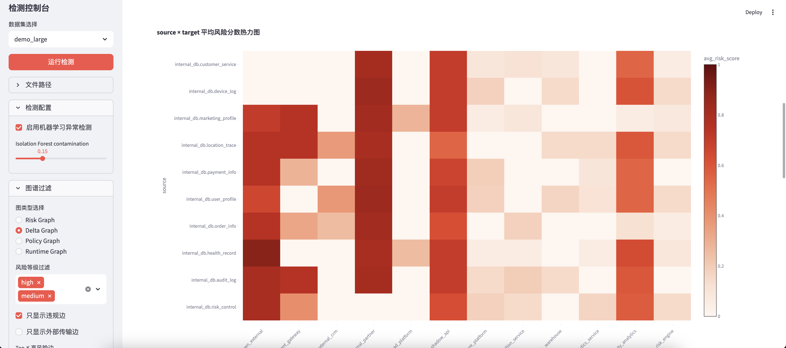
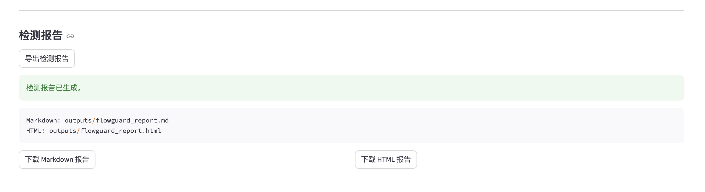

# 🛡️ FlowGuardGraph

FlowGuardGraph 是一个面向数据安全治理场景的轻量级原型系统，用于基于数据流图检测声明规则与实际数据流行为之间的不一致，识别非计划数据外传风险，并通过图谱、事件表、热力图和机器学习异常检测结果进行可视化预警。

## 🚀 核心能力

1. 声明—行为一致性检测：比对声明允许的数据流与实际日志行为，识别不一致流动。
2. 非计划数据外传识别：发现未授权外部传输、用途不一致、敏感字段外传等风险。
3. 敏感字段识别与风险评分：基于字段敏感等级、外部目标和声明一致性计算规则风险。
4. Isolation Forest 机器学习异常检测：对数据流行为特征进行无监督异常检测。
5. Delta Graph 差异图分析：突出声明规则与实际行为之间的差异路径。
6. Risk Graph 风险图谱展示：以有向图展示高风险数据流路径。
7. source-target 风险热力图：交互式展示 source 到 target 的平均风险分数和风险明细。
8. 多规模模拟数据集生成与演示：支持 demo_small、demo_medium、demo_large。

## 🖼️ 项目截图















## 🔄 系统流程

```text
声明规则 → 实际日志 → 数据流图构建 → 一致性检测 → 敏感字段识别 → ML 异常检测 → 融合风险评分 → 图谱与热力图预警
```

## 🧩 功能模块

- `policy_loader.py`：读取声明数据流规则。
- `log_parser.py`：读取实际数据流日志。
- `compliance_checker.py`：执行声明—行为一致性检测。
- `risk_analyzer.py`：敏感字段识别和规则风险评分。
- `ml_anomaly_detector.py`：Isolation Forest 无监督异常检测。
- `graph_builder.py`：构建 Policy / Runtime / Risk Graph。
- `delta_analyzer.py`：构建 Delta Graph。
- `visualizer.py`：生成交互式图谱。
- `demo_data_generator.py`：生成模拟数据集。
- `report_generator.py`：导出 Markdown / HTML 检测报告。
- `app.py`：Streamlit 前端系统。

## ⚙️ 安装方式

本项目使用 conda 管理环境。

```bash
conda env create -f environment.yml
conda activate flowguardgraph
```

如果环境已经存在：

```bash
conda activate flowguardgraph
pip install -r requirements.txt
```

## ▶️ 运行方式

```bash
streamlit run app.py
```

或者：

```bash
bash run_demo.sh
```

启动后访问 Streamlit 输出的本地地址，通常为 `http://localhost:8501`。

## 🧪 示例数据集

- `demo_small`：轻量测试数据集，适合快速功能验证。
- `demo_medium`：中等规模演示数据集，推荐用于截图和功能展示。
- `demo_large`：大规模模拟数据集，适合压力测试和统计分析展示。

所有数据均为模拟数据，不包含真实个人信息。

## 📊 风险评分机制

规则风险分数：

```text
risk_score =
0.4 × policy_violation
+ 0.3 × sensitivity_score
+ 0.2 × external_target
+ 0.1 × purpose_mismatch
```

其中：

- `policy_violation`：是否违反声明规则。
- `sensitivity_score`：字段敏感等级分数。
- `external_target`：是否流向外部系统。
- `purpose_mismatch`：是否存在用途不一致。

风险等级：

- `high`：`risk_score >= 0.75`
- `medium`：`risk_score >= 0.45`
- `low`：`risk_score < 0.45`

## 🤖 机器学习异常检测

系统使用 Isolation Forest 对数据流行为特征进行无监督异常检测。特征包括：

- `volume`
- `external_target`
- `policy_violation`
- `purpose_mismatch`
- `sensitivity_score`
- target 类型
- rule risk score

融合风险分数：

```text
hybrid_risk_score = 0.75 × risk_score + 0.25 × ml_anomaly_score
```

`hybrid_risk_score` 用于综合规则风险和 ML 异常程度，在启用机器学习检测时用于事件排序和风险提示。

## 🕸️ 图谱说明

- `Policy Graph`：声明允许的数据流图。
- `Runtime Graph`：实际发生的数据流图。
- `Risk Graph`：非计划数据外传风险图。
- `Delta Graph`：声明—行为差异图。

## ✅ 示例检测结果

以 `demo_medium` 为例，系统可以输出：

- 总事件数
- 违规事件数
- 高风险事件数
- 外部传输事件数
- ML 异常事件数
- Delta 边数
- Top 高风险事件
- source-target 风险热力图

具体数值以界面实时结果和导出的检测报告为准。

## 📄 检测报告导出

在 Streamlit 前端的“风险总览”页点击“导出检测报告”，系统会生成：

- `outputs/flowguard_report.md`
- `outputs/flowguard_report.html`

报告包含检测指标、Top 高风险事件、Top source-target 风险路径、风险分布、违规类型分布和简短结论。

## 📁 项目结构

```text
FlowGuardGraph/
├── app.py
├── flowguardgraph/
├── examples/
│   ├── demo_small/
│   ├── demo_medium/
│   └── demo_large/
├── docs/
├── screenshots/
├── tests/
├── environment.yml
├── requirements.txt
└── run_demo.sh
```

## 🧭 后续扩展方向

- 接入真实数据库审计日志。
- 支持流式数据接入。
- 支持更多 ML 异常检测算法。
- 支持字段级血缘追踪。
- 支持策略规则语言。
- 支持自动化合规报告。

## ⚠️ 声明

- 本项目是研究原型系统。
- 示例数据均为模拟数据，不包含真实个人信息。
- 本项目不直接替代正式合规审计。
- 本项目适用于数据流合规检测、非计划数据外传识别和风险可视化研究。
